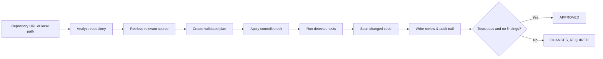

# LERX · Auditable AI Software Engineer

> **Load a repository. Define a change. Receive a test-gated, reviewable result.**

LERX is an autonomous software-engineering prototype designed around one rule: agent changes must be explainable. It retrieves relevant code, writes a scoped plan, applies controlled edits, runs tests and security checks, then stores the evidence as an audit record.

<p align="center">
  <a href="#quick-start">Quick start</a> ·
  <a href="#how-a-run-works">How it works</a> ·
  <a href="#api-tour">API tour</a> ·
  <a href="#project-layout">Project layout</a>
</p>

## What you can do

| Action | What LERX records |
| --- | --- |
| Attach a Git or local repository | Repository summary and workspace location |
| Ask for an engineering change | A validated plan and retrieved source context |
| Run the controlled workflow | Logs, file before/after states, test output and scan findings |
| Review the outcome | An `APPROVED` or `CHANGES_REQUIRED` review record |

## Quick start

The containerized agent stack lives in `LERX/` and is the easiest way to run the full system.

```bash
git clone <your-repository-url>
cd Agent_LERX-main/LERX
docker compose up --build
```

Open these local services once the build completes:

| Service | URL |
| --- | --- |
| Agent dashboard | http://localhost:3000 |
| FastAPI documentation | http://localhost:8000/docs |
| Health check | http://localhost:8000/health |

<details>
<summary><strong>Run the API locally instead</strong></summary>

You need Python 3.11+ and a PostgreSQL database configured through `DATABASE_URL`.

```bash
cd LERX/backend
python -m venv .venv
# macOS / Linux
source .venv/bin/activate
# Windows PowerShell
# .\.venv\Scripts\Activate.ps1
pip install -r requirements.txt
uvicorn app.main:app --reload
pytest -q
```

</details>

<details>
<summary><strong>Run the standalone product UI</strong></summary>

`frontend/web/` is a separate TanStack Start/Vite interface featuring the landing, login, demo and about pages.

```bash
cd frontend/web
bun install
bun run dev
```

`npm install && npm run dev` is also suitable if you prefer npm.

</details>

## How a run works



Each run is persisted in PostgreSQL with its agent log, generated plan, changed files, test transcript, security findings and final review.

### Safety boundaries

- Repository paths are resolved inside an isolated workspace to prevent path traversal.
- Destructive test commands are rejected by the execution policy.
- Security review detects hard-coded secrets, shell command injection and unsafe deserialization in changed content.
- The current built-in implementation capability is intentionally narrow: it supports adding a FastAPI health endpoint. Broader generation should be connected through an approved, structured LLM adapter.
- LERX does **not** automatically create branches or commits.

## API tour

The interactive API reference is available at [`/docs`](http://localhost:8000/docs) while the stack is running. The normal lifecycle is:

```bash
# 1. Register a repository
curl -X POST http://localhost:8000/api/projects \
  -H "Content-Type: application/json" \
  -d '{"repository_url":"https://github.com/acme/example.git","name":"example"}'

# 2. Create a task for project 1
curl -X POST http://localhost:8000/api/tasks \
  -H "Content-Type: application/json" \
  -d '{"project_id":1,"request":"Add a FastAPI health endpoint"}'

# 3. Schedule task 1
curl -X POST http://localhost:8000/api/tasks/1/run

# 4. Inspect progress and evidence
curl http://localhost:8000/api/tasks/1/status
curl http://localhost:8000/api/tasks/1/logs
curl http://localhost:8000/api/tasks/1/changes
curl http://localhost:8000/api/tasks/1/tests
curl http://localhost:8000/api/tasks/1/review
```

<details>
<summary><strong>Endpoint reference</strong></summary>

| Method | Endpoint | Purpose |
| --- | --- | --- |
| `POST` | `/api/projects` | Register a repository |
| `POST` | `/api/analyze` | Clone/inspect a project and return its summary |
| `POST` | `/api/tasks` | Create a requested change |
| `POST` | `/api/tasks/{task_id}/run` | Schedule the agent workflow |
| `GET` | `/api/tasks/{task_id}` | Read the task and plan |
| `GET` | `/api/tasks/{task_id}/status` | Read current agent and run state |
| `GET` | `/api/tasks/{task_id}/logs` | Read timestamped run log events |
| `GET` | `/api/tasks/{task_id}/changes` | Read recorded file diffs |
| `GET` | `/api/tasks/{task_id}/tests` | Read test command and output |
| `GET` | `/api/tasks/{task_id}/review` | Read verdict and security findings |

</details>

## Project layout

```text
Agent_LERX-main/
├── LERX/                         # Runnable agent platform
│   ├── backend/                   # FastAPI, workflow, database models and tests
│   ├── frontend/                  # Docker-served React dashboard
│   └── docker-compose.yml         # PostgreSQL + backend + dashboard
├── frontend/web/                  # Standalone TanStack/Vite marketing UI
└── Autonomous AI Software Engineering Agent Build Prompt.pdf
```

## Technology

| Area | Tools |
| --- | --- |
| API and orchestration | FastAPI, Pydantic, LangGraph |
| Persistence | PostgreSQL with SQLAlchemy and Psycopg |
| Container stack | Docker Compose, Nginx, pgvector/PostgreSQL |
| Container dashboard | React + Vite |
| Standalone UI | React 19, TanStack Start/Router, Tailwind CSS, Radix UI |

## Verification

Run the backend tests from `LERX/backend`:

```bash
pytest -q
```

Build the standalone UI from `frontend/web`:

```bash
bun run build
```

## Current scope

LERX is an auditable prototype, not an unrestricted code-execution service. Before using it with untrusted or production repositories, execute test commands in a locked-down sandbox, supply least-privilege credentials, and add a human approval step before applying or committing generated changes.

---

Built for teams that want automation **and** an evidence trail.
